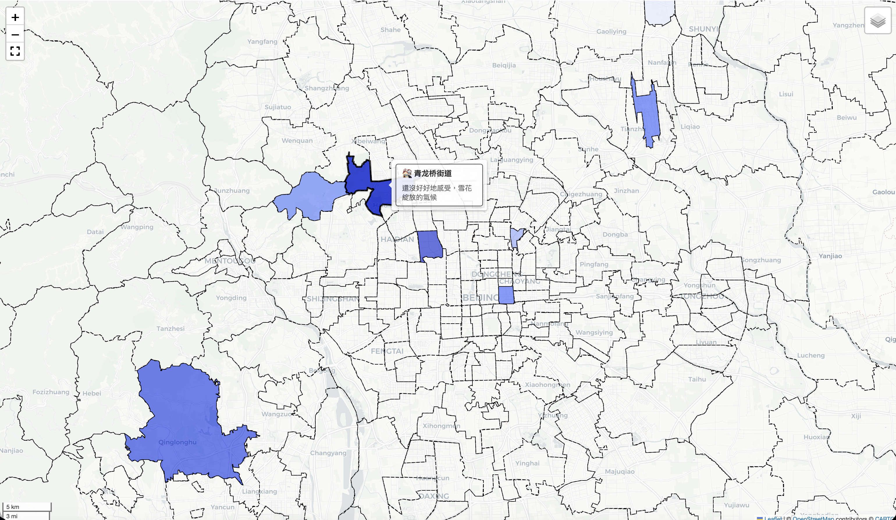

# Beijing Memory Map | 一个人的北京地方志

An interactive geospatial visualization platform designed to archive and visualize urban memories across Beijing's administrative divisions.

[English](#introduction) | [中文说明](#项目简介)

---

## Introduction | 项目简介

<table width="100%">
<tr>
<td width="50%">
<strong>Beijing Memory Map</strong> is a data-driven visualization tool that transforms qualitative urban narratives into an interactive spatial experience. Utilizing Python, Folium, and Pandas, the project allows users entering their own stories and those related to each neighborhood in Beijing into the form, which will then automatically generate a visual interface. Users can rate each neighborhood to indicate the depth of their connection and bond with it; the higher the score, the darker the color on the map. Users can also write brief descriptions and stories for each neighborhood. When the mouse hovers over a neighborhood’s location, a pop-up window displays the neighborhood’s name and brief description; clicking on it reveals the neighborhood’s name and story.

Translated with DeepL.com (free version)
</td>
<td width="50%">
<strong>一个人的北京地方志</strong> 是一个数据驱动的可视化工具，让用户可以记录自己与北京的故事，将对于城市的记忆转化为交互式的界面。本项目利用 Python、Folium 和 Pandas，用户可以在表格中输入自己和北京市每个街道的故事，然后自动生成可视化界面。其中，用户可以为每个街道打分，表示与其联系和缘分的深浅，分值越高在地图中的颜色越深。同时用户可以为每个街道撰写简述和故事，鼠标悬置在街道的位置时会弹窗显示街道名称和简述，点击后显示街道名称和故事。
</td>
</tr>
</table>

---
<p align="center">
  
</p>

## Core Features | 核心功能

| Feature | Description | 描述 |
| :--- | :--- | :--- |
| **Dynamic Rendering** | Real-time map generation based on Excel data updates. | 基于 Excel 数据更新的实时地图生成。 |
| **Thematic Styling** | Choropleth mapping where color intensity reflects "Fate" (connection) scores. | 专题地图样式，颜色深浅反映“缘分”分值。 |
| **Rich Interaction** | Hover for metadata summaries; click for comprehensive narratives. | 悬停显示摘要；点击查看完整叙述。 |
| **Privacy Focused** | Fully local execution ensuring data sovereignty and privacy. | 完全本地执行，保护隐私。 |

---

## System Architecture | 系统结构

- **Data Layer**: Structured storage in Excel/CSV format for intuitive content management.

  **数据层**：采用 Excel/CSV 格式进行结构化存储，便于内容管理。
- **Processing Layer**: Python-based pipeline for data cleaning, GeoJSON merging, and spatial join.

  **处理层**：基于 Python 的数据清洗、GeoJSON 合并及空间关联处理流水线。
- **Visualization Layer**: Folium (Leaflet.js) powered interactive HTML interface.

  **展示层**：基于 Folium (Leaflet.js) 的交互式 HTML 界面。

---

## Installation | 安装

```bash
# Clone the repository
git clone https://github.com/userAnabolix/Beijing-memory-map.git
cd Beijing-memory-map

# Install dependencies
pip install -r requirements.txt
```

## Configuration | 数据配置

Due to copyright and privacy constraints, original geospatial and personal narrative data are excluded from this repository. You must provide your own data to run the pipeline.
由于版权限制，北京地图数据不包含在本仓库中。您需自行配置数据以运行。配置方法如下：

### 1. Spatial Data (GeoJSON) | 空间数据 (GeoJSON)
- Create a directory named `geojson_data` in the project root.

  在项目根目录创建一个名为 `geojson_data` 的文件夹。
- Place your street/township level GeoJSON files (`.json`) inside the directory.

  将街道/乡镇级别的 GeoJSON 文件（`.json`）放入该目录。
- **Data Source**: The recommended high-precision GeoJSON data for Beijing is sourced from the [AreaCity-JsSpider-StatsGov](https://github.com/xiangyuecn/AreaCity-JsSpider-StatsGov) repository.
  - *Note: You can use the exclusive promo code `AREA-CITY-BJ-10` to get a 10 RMB discount (Non-AFF, shared purely for community benefit).*

  **数据来源**：推荐使用 [AreaCity-JsSpider-StatsGov](https://github.com/xiangyuecn/AreaCity-JsSpider-StatsGov) 仓库提供的高精度北京市 GeoJSON 数据。
  - *注：您可以使用专属优惠码 `AREA-CITY-BJ-10` 获得 10 元人民币折扣（非推广链接，纯属社区分享）。*
- **Crucial**: Coordinates must be strictly in **WGS84 (EPSG:4326)**. Using GCJ-02 or BD-09 will result in significant map offset.

  **重要**：坐标系必须严格使用 **WGS84 (EPSG:4326)**。使用 GCJ-02 或 BD-09 将导致地图出现明显偏移。

### 2. Tabular Data (Narratives) | 表格数据（叙述）
- Use the provided `beijing_streets_data_template.csv` as a schema reference.

  使用提供的 `beijing_streets_data_template.csv` 作为数据格式参考。
- Save your populated data as `beijing_streets_data.xlsx` in the project root. The pipeline will automatically prioritize the Excel file over the CSV template.

  将填写好的数据保存为 `beijing_streets_data.xlsx`，放在项目根目录。处理流水线会自动优先使用 Excel 文件，而非 CSV 模板。

## Usage | 运行指南

Execute the rendering script to generate the HTML map:
运行渲染脚本以生成 HTML 地图：

```bash
python beijing_streets_final.py
```

The output `beijing_streets_final.html` will be generated in the root directory and opened via your default web browser.
生成的输出文件 `beijing_streets_final.html` 将保存在项目根目录，并通过系统默认浏览器自动打开。

---

## Technical Specifications | 技术规范

- **Coordinate System**: WGS84 (EPSG:4326).

  **坐标系**：WGS84 (EPSG:4326)。
- **Data Granularity**: Street/Township level (342+ unique administrative units).

  **数据粒度**：街道/乡镇级（342+ 唯一行政单元）。
- **UI/UX**: Custom CSS injection for responsive tooltips and scrollable popups.

  **用户体验**：自定义 CSS 注入，支持响应式工具提示及可滚动弹出窗。

